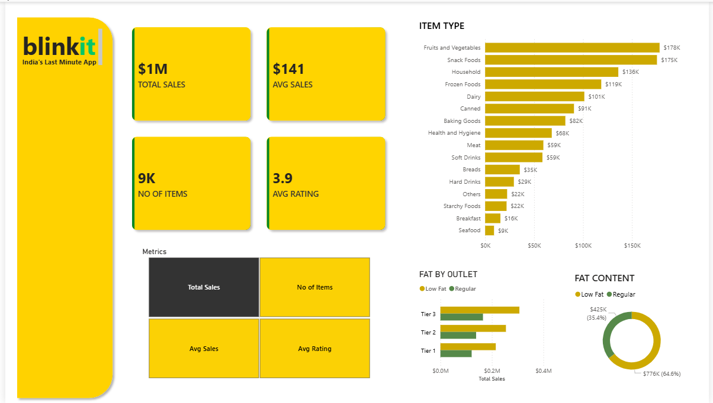

# Blinkit Sales Dashboard (Power BI)

## Overview
This project analyzes Blinkit grocery sales data using Power BI to derive business insights and visualize key performance metrics.

## Features
- Total Sales, Average Sales, Number of Items, Average Rating (KPIs)
- Sales distribution by Item Type
- Outlet-wise sales comparison
- Fat content analysis (Low Fat vs Regular)

## Tools Used
- Power BI
- DAX
- Data Visualization
- Excel

## Dataset
The dataset used for this project is included in this repository.

## Key Insights
- Fruits & Vegetables generate the highest revenue
- Tier-based outlet performance varies across categories
- Low-fat products contribute more to total sales

## Dashboard Preview

